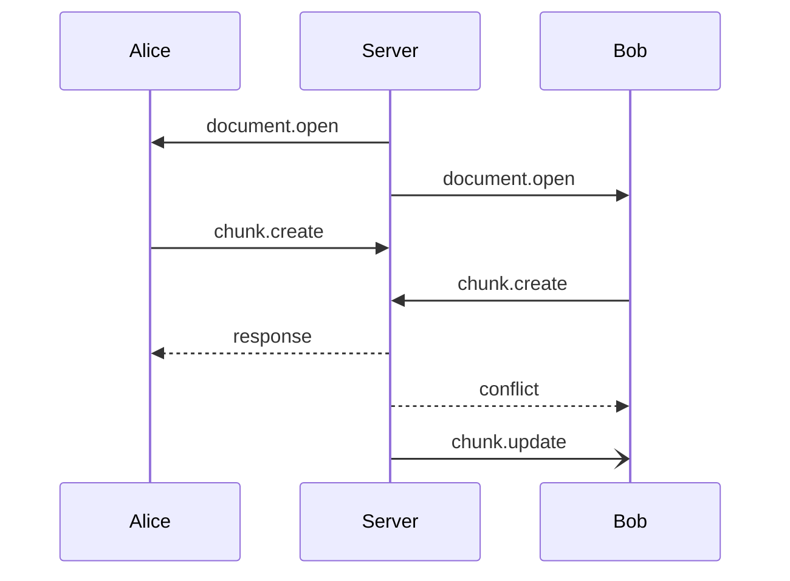
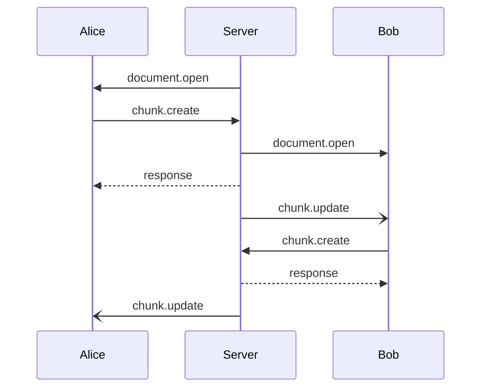

# Synchronize

동기화 정책은 이렇다. 기본적으로 상대문서의 갱신 시간과 나의 갱신 시간을 비교하고 상대문서가 최신이 아니면 거부한다. 메소드가 실행 순서에
무관하면 언제나 실행하고 갱신한다.

예를 들어, 다음과 같은 상황이 있다.

처음에 Server에서 Alice와 Bob이 문서를 받아왔다. 그리고 Alice가 `chunk.create` 메소드를 보내고 Bob이
`chunk.create`메소드를 보냈다. 그러면 Server는 Alice가 먼저 도착했으므로 Alice의 메소드을 처리하고 최근 갱신 시간을
갱신한다. 그리고 Bob의 메소드를 처리할때 Bob의 문서의 최근 갱신 시간이 Server 문서의 최근 갱신 시간보다 작으므로 거부한다.

별개로 Alice의 갱신사실을 알리기 위해서 Bob에게 `chunk.update`를 보낸다.

다른 예로 다음과 같은 상황에서는 이렇다.

여기서는 Bob의 문서가 최신이기 때문에(**문서 갱신 시간이 Server와 같기 떄문에**) 거부되지 않고 처리되는 것을 볼 수 있다.

그와 별개로 갱신 사실을 알리기 위해서 `chunk.update`가 Alice와 Bob에게 전달되는 것을 볼 수 있다.

현재는 최적화될 여지가 많다.
